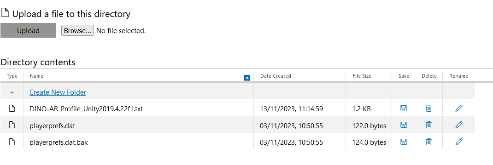
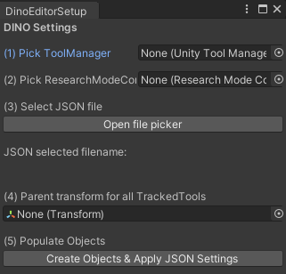
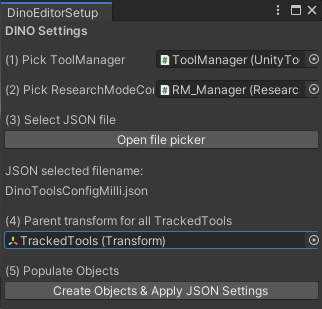
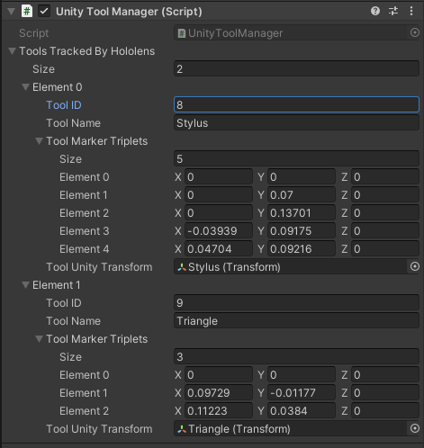
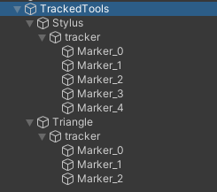

# Tutorials

## 1. Using the DINO-Unity app

### Scene Info
The project contains two scenes:

1. `SampleScene.scene` Bare-bones app, just displays info and positions virtual objects based on marker location
2. `SampleSceneMRTK.scene` Does everything that `SampleScene` does, but has MRTK interactions set up and enabled, so you can resize windows, and interact with the DLL through 3D buttons

Both scenes contain three main groups of objects. 

1. Displays of sensor data, grouped under an object called RMContainer. This is just a 2D display of sensor images from the AHAT sensor. The shader used for this image originates from [Hololens2-ResearchMode-Unity](https://github.com/petergu684/HoloLens2-ResearchMode-Unity/).
2. Two debug text canvases: 
    * `CanvasText` has been used as a very basic error printer, and is also used to retrieve a profiler string from [`DINO-DLL`](https://github.com/HL2-DINO/DINO-DLL), giving you more info about how long each image processing step takes.
    * `ToolDictionaryPrinter` which prints a 4x4 matrix for each tool you're tracking. 

    > **Note**: The two canvases and sensor displays are all grouped under `RMContainer`, so you can move around sensor images and debug string canvases as one big object. This will be referred to as a 'visualiser' for the rest of the doc.
3. Tracked tools: virtual models which appear rigidly fixed to your tools     

### Running the App

By default, the app has been set up to compile and run `SampleSceneMRTK.scene` on the HoloLens 2. 

Once you've deployed the app to your HoloLens 2 (see README.md in the repo for instructions on this), you have a basic UI and some buttons which you can use.


To use these buttons, open up and face your left palm towards the headset, and a little palm menu with 3 buttons should appear. You can press these buttons with air-taps or by physically poking them with your right index finger. 

<strong>(1) Print Profiler</strong>

This button will dump a profiler string to a file located at `ApplicationData.Current.LocalFolder.Path`. This provides timing info on processes being carried out on the C++ DLL side. You can decorate the DLL code with calls to the Shiny profiler, which will change what information is profiled. 

When you hit the button, the string will print to the canvas, and be automatically saved to the local data store for the app, which you can access from the Windows Device Portal. Once you connect to the headset through the Device Portal, go to the following location (e.g. for Unity 2019):

`LocalAppData\Dino-Unity-2019_1.....\LocalState\`



<strong>(2) Fetch Visualiser</strong>

This button is intended to retrieve the visualiser for the sensor images and the debug text if you move around in space. It will simply move the visualiser to face the user and place it about a metre away.

<strong>(3) Toggle Sensor Data</strong>

In theory [`DINO-DLL`](https://github.com/HL2-DINO/DINO-DLL) will always be processing sensor images from the headset to detect tools. But we can choose to toggle whether these images are actually updated/processed for display on the Unity side. By toggling this off, you can save some basic image processing steps which can help speed the app up marginally. When the toggle is off, we stop displaying sensor images, and vice versa.

## 2. TrackedTool Definition {#tracked-tool}

Universally across the DINO Unity app, we describe a trackable IR instrument with the following properties:

```cs
namespace ToolTrackingUtils
{
    public class TrackedTool
    {
        public int ToolID;
        public string ToolName;
        public List<Vector3> ToolMarkerTriplets;
        public Transform ToolUnityTransform;
        public Matrix4x4 Tool_HoloFrame_LH;
        public bool VisibleToHoloLens;
        public float TimestampLastSeen;        
    }
}
```

In the lifecycle of the app, the properties are used as follows:

* `ToolID`: Used as a unique identifier in internal maps/dictionaries.
* `ToolName`: Used to name the GameObject associated with this tool in the Unity hierarchy.
* `ToolMarkerTriplets`: Internal storage of all the marker-centre locations (in left handed coordinates).
* `ToolUnityTransform`: Unity transform corresponding to the tool that we will position. 
This transform can be used as a parent for things we want to attach to the TrackedTool (3D models or other key-points).
* `Tool_HoloFrame_LH`: A 4x4 transform matrix which describes where the tool is with respect to the HoloLens 2's world frame 
(a coordinate frame located at the startup position and rotation the headset).
* `VisibleToHoloLens`: Bool which reflects the visiblity of the tool to the headset, set from the DLL side.
* `TimestampLastSeen`: A float value which is updated on the Unity side to track. 
At the moment, this is just used to track if the tool has not been seen for a number of seconds.

## 3. JSON Object Formatting {#json-object-formatting}
This app reads in a JSON object from the `StreamingAssets` folder in a particular format to understand the geometries of tools
we're interested in tracking.

```json
{
"fileSettings": {"units" : "mm"},
"tools": [
    {"name": "Stylus",
    "id": 8,
    "coordinates":
    [["0","0","0"],
    ["0","70","0"],
    ["0","137.01","0"],
    ["-39.39","91.75","0"],
    ["47.04","92.16","0"]]},
    
    {"name": "Triangle",
    "id": 9,
    "coordinates":
    [["0","0","0"],
    ["97.29","-11.77","0"],
    ["112.23","38.4","0"]]}
]
}
```
There are two top-level file-keys:
`fileSettings` and `tools`.

### File Settings

You can choose to specify file units as metres (`m`) or millimetres (`mm`).

### Tools

The `tools` field contains an array of key-value packets. Each array member, which is a single tool,
should be structured like this:

```json
    {
        "name": "Stylus",
        "id": 8,
        "coordinates":
            [
             ["0","0","0"],
             ["0","70","0"],
             ["0","137.01","0"],
             ["-39.39","91.75","0"],
             ["47.04","92.16","0"]
            ]
    }

```
| Key           |                                                       Description                                                  |
|---------------|--------------------------------------------------------------------------------------------------------------------|
|`name`         | A string identifier, used to label the Transform associated with this tool in Unity                                |
| `ID`          | A unique numeric value (should be between 0-255), which is used to identify this tool in internal maps/dictionaries|
| `coordinates` | An array composed of 'coordinate' values, telling you the 3D location of each marker attached to the tool.         |

> **Note:** A single 'coordinate' is a 3D vector. So a tool with 5 markers, would have 5 entries in the `coordinates` array. 
Each coordinate itself is an array, containing 3 string values, ordered as [x,y,z]. This value corresponds to the centre of each IR 
reflective marker. 
**IMPORTANT**: The units should be consistent within a single JSON file for all tools. These values should follow a right-handed convention. 
Left handed conversion is done inside Unity by inverting the 'z' component. 

## 4. AimTool Model Tracking

AimTool models use a newer Unity-side model tracking path. This path is separate from the `StreamingAssets` JSON tool configuration described above and separate from the DINO-DLL tool dictionary. The DLL can still track the tools listed in the JSON config, but AimTool model rendering is driven by Unity-side infrared marker detection and the generated AimTool assets under `Resources`.

AimTool source files live in the repository-level `AimTools` folder. Each model needs a pair of files with the same filename prefix:

```text
AimTools/<model-name>.aimtool
AimTools/<model-name>.stl
```

Keep these source files in their original AimTool coordinate convention: right-handed coordinates in millimetres. Do not edit the `.aimtool` marker coordinates or `.stl` vertices to make them look like Unity coordinates.

To import or refresh AimTool assets:

1. Copy the `.aimtool` and matching `.stl` files into the repository-level `AimTools` folder.
2. Open the Unity project.
3. Run `DINO Unity > Import AimTools` from the Unity menu bar.
4. Confirm that Unity generated `<model-name>.obj` and `<model-name>.markers.json` under `Assets/Resources/AimTools`.

The importer reads the `.aimtool` file by ignoring the first two lines, reading the third line as the marker count, and then reading that many `x y z` marker coordinate lines. A fourth value on each marker line is ignored. Marker coordinates are converted from right-handed millimetres to Unity left-handed metres. The matching STL is converted to an OBJ in the same generated Unity coordinate frame, including the compensation needed for Unity's OBJ importer.

Do not manually apply the 180 degree Y-axis rotation described in the next section to AimTool assets generated by `DINO Unity > Import AimTools`. That older workaround is only for hand-imported custom OBJ models.

At runtime, `ResearchModeController` ensures that an `AimToolModelTracker` exists. The tracker loads all valid marker JSON/model pairs from `Resources/AimTools`, so you do not need to wire each imported AimTool model into the scene manually.

For an AimTool model to appear:

* `Detect Markers In Unity` must be enabled before the app starts.
* The sensor-image update path must be running. If the palm-menu `Toggle Sensor Data` button disables sensor data, new marker frames are not queued and AimTool model poses stop updating.
* At least all markers from the model's generated marker template must be visible and resolved to 3D world points. The current matcher displays a model only when its complete marker template is matched; extra observed markers are allowed.
* Each generated marker template must contain at least 3 markers.

The Python raw sensor server is not required for AimTool pose matching. Unity can render AimTool models from its local infrared marker detection and depth projection even though the TCP stream is still useful for server-side visualization and diagnostics.

`AimToolModelTracker` exposes useful Inspector settings:

* `Max Marker Error Metres`: maximum final 3D error allowed for a matched marker.
* `Distance Tolerance Metres`: pairwise marker-distance tolerance during matching. A value of `0` uses `Max Marker Error Metres * 2`.
* `Max Observed Markers`: cap on how many observed marker points are searched.
* `Max Search Nodes Per Tool`: search budget for one model template.
* `Lost Visibility Timeout Seconds`: how long an unmatched model remains visible before being hidden.
* `Jitter Smoothing Distance Metres` and `Jitter Smoothing Factor`: small-motion smoothing controls.
* `Hide Models When Unmatched`: hide stale models instead of leaving them in the last matched pose.
* `Log Matches`: print match quality information while debugging.

If an AimTool model does not appear, first check that `Assets/Resources/AimTools/<model-name>.markers.json` and `<model-name>.obj` both exist, the marker JSON has at least 3 markers, `Detect Markers In Unity` is enabled, the IR marker spheres are being detected, and enough markers from that specific AimTool are visible to the HoloLens.

## 5. Importing Custom 3D Models

By default, an `.obj` file is defined to have right-handed vertex data. When importing into Unity, there appears to be an automatic process carried out by the Unity editor which inverts all x coordinate data.

In this app, the convention is to invert the z values of all right-handed coordinates to go into Unity's left-handed coordinate system ([check this link](https://learn.microsoft.com/en-us/windows/mixed-reality/design/coordinate-systems#spatial-coordinate-systems) for a good reference diagram).

This section applies to manually imported custom OBJ models. It does not apply to AimTool OBJ files generated by `DINO Unity > Import AimTools`, because that importer already performs the required coordinate conversion and Unity OBJ-import compensation.

So if you want to import in a 3D model into Unity for this app: you need to account for the following:

1. Make sure your 3D model is in the same coordinate system as your tool config data, and that they share the same origin.

2. Inside the inspector for your 3D model on Unity, you'll need to set a rotation around the y-axis of 180 degrees from the inspector on Unity, to account the automatic x inversion done on import.


## 6. Tracking Custom Geometries {#custom-geometries}

(1) Make sure you place [a properly formatted JSON file](#json-object-formatting) in the `StreamingAssets` folder

(2) In your Unity scene, make sure you have exactly one instance of `ResearchModeController.cs` and `UnityToolManager.cs`

(3) From the menu-bar: *[DINO Unity] -> [DINO Setup]*:



(4) Populate fields 1 & 2, click on the little target icon on the right to automatically pop up a menu that lets you select your scene's instances of `ResearchModeController.cs` and `UnityToolManager.cs`

(5) Use the file-picker to select whichever config file inside your `StreamingAssets` folder you want to compile the app with

(6) Select a parent transform for a GameObject under which all your 'TrackedTools' will be grouped. The name or object you choose shouldn't matter too much, this is just so we can place all the TrackedTools under one parent object.

(7) Hit the button to populate objects, which will: 
    
  A. Tell your instance of `ResearchModeController.cs` where to look in the `StreamingAssets` folder for a config file, and 
    
  B. Properly format and populate the `ToolsTrackedByHololens` field in your instance of `UnityToolManager.cs`

  

(8) Review your Unity scene, you should see the above properties have changed in your scripts.

  

  <br></br>

  

Example config file used:

```json
{
"fileSettings": {"units" : "mm"},
"tools": [
    {"name": "Stylus",
    "id": 8,
    "coordinates":
    [["0","0","0"],
    ["0","70","0"],
    ["0","137.01","0"],
    ["-39.39","91.75","0"],
    ["47.04","92.16","0"]]},
    
    {"name": "Triangle",
    "id": 9,
    "coordinates":
    [["0","0","0"],
    ["97.29","-11.77","0"],
    ["112.23","38.4","0"]]}
]
}
```

